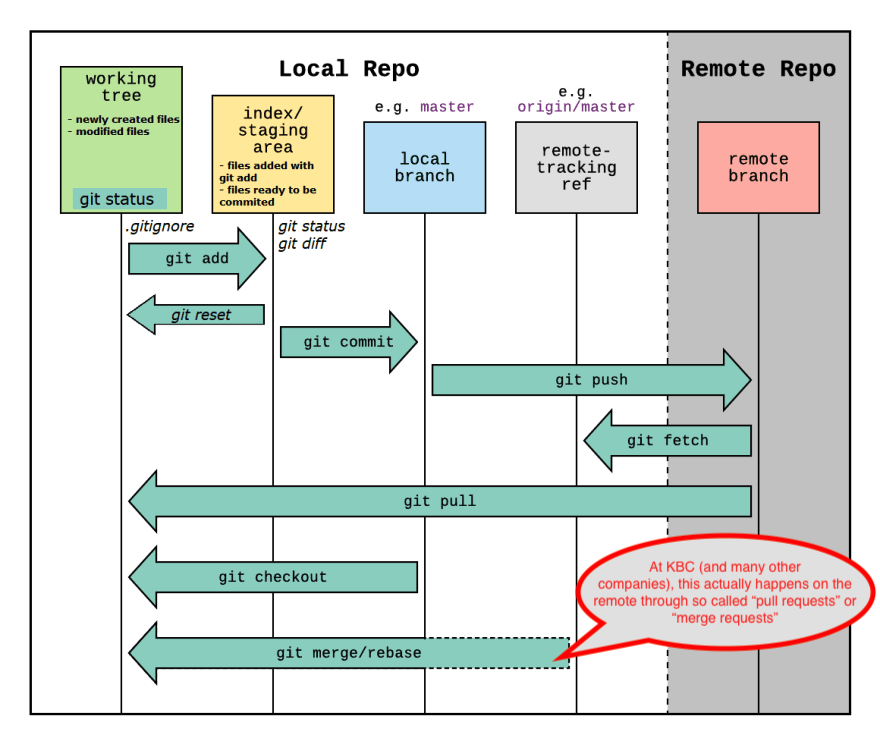
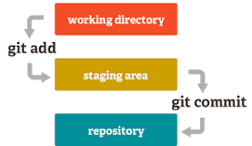
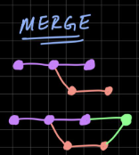
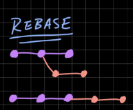
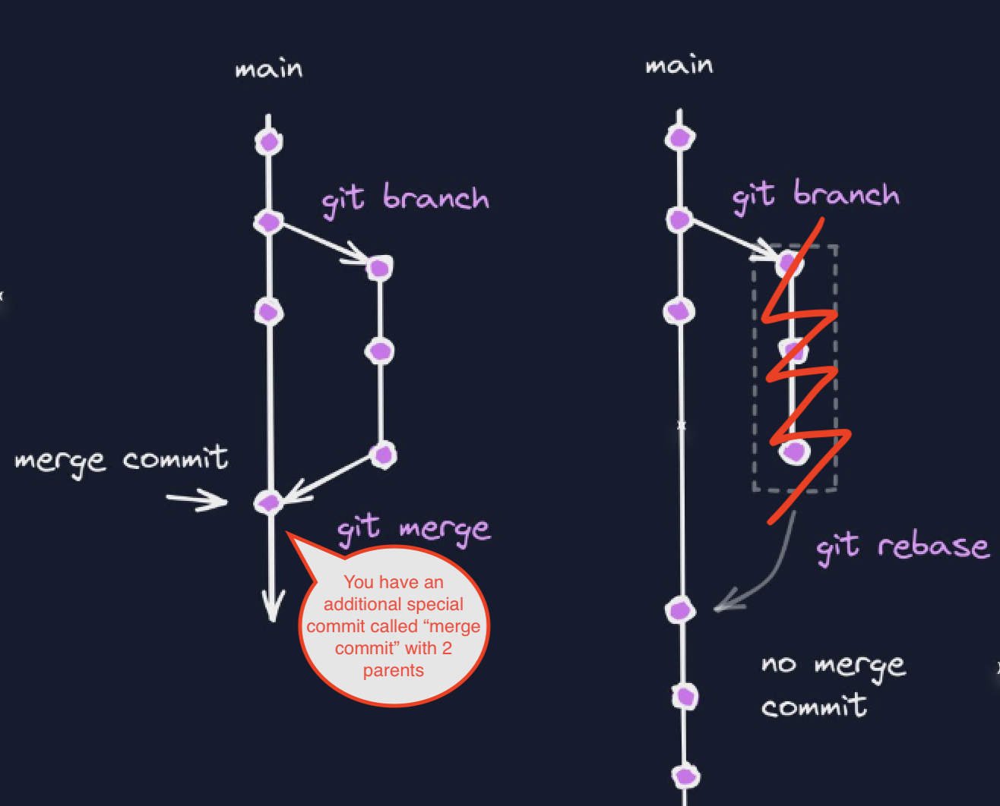
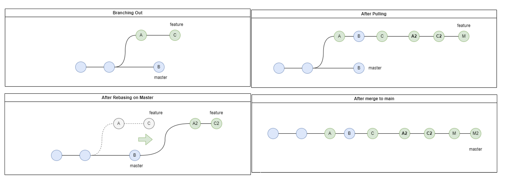

# Git

## What is Git ?
Git is basically a tool or a set of functions/methods/tools available through designed to work with a type of linked list (or more precisely and directed acyclic graph DAG, if you go to edison you will hear more of this concept as it is used a lot in the context of scheduling jobs) of DIFFS. Where a DIFF is a line-oriented rather than character-oriented, difference between two different versions of a file. In this workshop DIFF and COMMIT are used interchangeable, but in practice a commit is actually a collection of DIFFs registered by git for a repository. A git repository has the following structure:

```
Name_of_your_project
├── .git    <----------------------- !!!
│── a.py
│── b.py
│── subfolder
│── ...
└── README.md
```
.git contains all information required for version control. If you want to clone your repository, copying .git is actually enough. It contains all commits, branches (which is just a pointer to a commit), the staging area, etc...



Keep the above image in the back of your mind. You have a working directory (the directory on your computer) with a staging area. You also have a local branch, and a remote-tracking ref (which is just a local copy of a remote branch), and this communicates with a remote server, usually called origin.

|||
|---|---|
|| The above image can look rather complex, but the most important part is summarized on this left image. The staging area is basically just a concept invented to facilitate the selection process of the files you are ready to add to your commit and push to the remote later on.|


### Git commands
You don't need to remember the commands, just that they exist, and quick google search is usually enough to find them back. Have a look [here](https://www.loginradius.com/blog/engineering/git-commands/) if you want to see the most used git commands. Here are the ones you will need today.

| Syntax      | Description |
| ----------- | ----------- |
| ``` git  --help```| for all available commands |
| ``` git [command] --help```| for all available options related to a specific command  |
| ``` git clone <url>  ```     | clone a repository hosted at ```<url>```      |
|``` git status``` |  to have an overview of your working directory, staging directory and untracked files|   
|``` git pull origin [branch_name] ``` | pull remote branch_name into the current branch |
| ``` git add [name of the file]```   | Add the file to the staging area         |
| ``` git commit -m "What you did in this commit" ```  | Add all files in staging area as a diff to the current branch in your repository|
| ``` git log ```     | View commit history on the current branch |
| ``` git push -u origin master ```      | push your local branch to the master branch on the remote named origin        |
| ``` git remote ```   |  shows all the remotes (GitHub repositories) where you can push the last (local) commi        |
| ```git config``` | setup your user.email and user.name in configuration files so git know who to attribute the commit to. Important to track who is doing what. And at KBC you are allowed to only push your own commits so it will fail if you did not do this at one point or at globally at. If you want to know if this was done, you can do ``` git config --global --list ```to see the global git configuration on your computer. |
|``` git checkout [branch_name] ```| switch to a branch|
|``` git checkout -b   [branch_name]```| create and switch to ```branch_name ``` |

 


 


# The Workshop

## Requirements

Make sure you have git client installed on your computer. On glow laptops you can access it through ``` git bash ``` in the application launcher. Also, make sure you can perform this operation sucesfully ``` git clone git@github.com:jeromevde/git-workshop.git```. If not, and you get the error ```Permission denied (publickey).```, it means you need to setup your ssh key as follows:
- ``` ssh-keygen``` in a unix terminal (git-bash)
- ```enter``` let it be the default location
- ```enter``` choose an empty passphrase
- ``` enter``` confirm the empty passfphrase
- You get something like ```Your public key has been saved in [some_path]/.ssh/id_rsa.pub.```
- ```cat [some_path]/.ssh/id_rsa.pub``` will yield something like    
```ssh-rs* AAAAB3NzaC1yc2EAAAADAQABAAA ... sAZIhskyfQR jovyan@dsq-rmo-sandbox-jh-jupyter-jf41043```
- go to [manage account --> SSH keys](https://github.com/settings/keys) on github and add a key, by copying the above result.
- You should now be able to clone

Finally, make sure git ```user.email=name.lastname@kbc.be``` and ```user.name=first_name``` are correctly set by running ```$ git config --list --show-origin```. If the terminal does not return anything to you, you should perform:
- ```git config --global user.name "first name"```
- ```git config --global user.email name.lastname@kbc.be```
- rerun ```git config --list --show-origin``` to verify the results


## Context

Arrange yourselves in teams of 2. This tutorial will walk you through a simple git use case throug the terminal. It was chosen to use the terminal because this is the most universal and framework agnostic way of using git, whichever environment you will face usually has a terminal, and using a GUI is then just a matter of finding the button that corresponds to the command you already know.


```
The big boss / overboss reviewed the number seats available to RMO colleagues in the Brussels office. He came to your team to ask for help to push the changes in KBC's seat allocation system that is implemented in git and hosted on a bitbucket server, with a ```allocation.txt``` file:
- M&MR : 60 seats
- Validation : 40 seats
- RMO : 10 seats
- IMD : 10 seats
You are tasked with adding seats to the total seats of M&MR and seats to RMO's allocation.


```
  


* Use ```ctrl+R``` to access old terminal commands you did before, if you don't want to retype the same every time. You can go further back in history by pressing ```ctrl+R``` multiple times
* use ```TAB``` to autocomplete names of files or commands
* If you run into trouble, try to use ```git log```to visualize the git history tree, and then use google to search for the command that corresponds to the action you want to peform, such as "How to remove the last commit" or "How to remove a file from the staging directoy", and you will usually stumble on the right answer**  
* When talking about the master branch, we mean the master branch of your team, not the global master, which is blocked anyways.


## FIRST STRATEGY : MERGE

|||
|---|---|
|| This is an example of a merge strategy. We can see a repository build up from successive [diff](https://en.wikipedia.org/wiki/Diff)'s. At one point two people start working together and hence the repository branches into two different paths. At some point this needs to be resolved. In this case we will resolve it by adding another special type of commit (= a diff !) called a merge-commit that has two parents, and that will define the latest state of the repository. If there are no conflicts, the command happens automatically. If there are conflicts, the person performing the merge commit has to decide which modification of which parents will prevail. |


|Step|Person A from RMO performing a remote merge between master and feature branch| Person B from validation pushing some changes to master directly|
|---|---|---|
|0 | ```git clone git@github.com:jeromevde/git-workshop.git``` to clone the repository. You are a proficient git user. So you will not push on master. Create a new branch and check it out with ``` git checkout -b feature_[name_of_your_team] ```. If you want to know what the ```-b``` flag is for, you can have a look at ```git checkout --help```. You can exit the help dialogue by pressing the letter ```q```.  Perform ```git branch```to make sure you are on the correct branch. You just created a branch from the terminal, while your colleague created a master branch for your team from the bitbucket remote server GUI. Both ways are equivalent.| Go on the bitbucket and click on the three dots ... to the right of master and select "Create branch from here". Call you branch ```master_[name_of_your_team]```. ```git clone git@github.com:jeromevde/git-workshop.git``` to clone the repository. And then ```git checkout master_[name_of_your_team]```. If you already cloned the repository before creating the branch, this will not work, because you don't have the newly created branch on your computer. You need to fetch it with ```git fetch``` and then creating a local branch from the remote copy with ```git checkout -b  master_[name_of_your_team] origin/master_[name_of_your_team]```.  You are now on the master branch created for you team. You can make sure of that by executing ```git branch``` |
| 1 |  Make the seat allocation modification to ```allocation.txt```. Now peform ``` git status``` to look see the changes. ```allocation.txt``` should appear in red because you modified it. After that, you need to add the file to the staging area using using ``` git add allocation.txt```. Now perform ```git status``` to check whether files were correctly staged. ```allocation.txt``` should now appear in green to indicate it has been added to the staging area. Now commit (aka add a diff) the file from your staging area to the repository with ```git commit -m "updated allocation.txt```. Finally, you can push to the remote with ``` git push origin feature_[name_of_your_team] ```. This is a syntactic sugar that will create  a remote branch carrying the same name as your local branch, as this is standard practice. You can however juggly with branch names and push your local branch to a different remote branch name, in which case you would use the following syntax: ```git push origin [local_branch_name]:[remote_branch_name]``` where git will create if the remote branch name if it doesn't yet exist. |  As a validator, you heard there is some extra seats, and you try to directly push to master, but distribute 1 million to RMO and 1 million to Validation. You stay on the ```master_[name_of_your_team]``` branch. Change the allocation accordingly. After that, you need to add the file to the staging area using ``` git add allocation.txt``` and then push the code to your branch using ``` git commit -m "added seats for validation``` and then push using ``` git  push origin master_[name_of_your_team]```|
| 2 |  ```git fetch``` and ```git log --all --decorate --oneline --graph ``` to have a look at the repository history tree|  ```git fetch``` and ``` git log --all --decorate --oneline --graph ``` to have a look at the repository history tree. You can exit this by clicking ```q```|
| 3 | Go to the [github](https://github.com/jeromevde/git-workshop) and click on "create a pull request". You should select your branch as source branch and choose master_[name_of_your_team] (not the master branch of the repo, it is blocked anyways) branch as a target branch. ||
||How annoying, someone pushed directly to master and you now have a conflict, blocking you from merging the code. But you can resolve conflicts locally by adding a special commit called a "merge-commit" taking both changes as input and selecting the right output. ```git branch -b master_[name_of_your-team] origin/master_[name_of_your_team``` to get the master of your team locally, without switching to it (if you wanted to switch too, use checkout). ```git merge feature_[name_of_your_team] master_[name_of_your_team]``` to initiate the merge. Git will signal you that it has detected conflicts, and in which files. If you open the ```allocation.txt``` you will notice the that it added some lines ```<<<<<<< HEAD```as well as ```======``` and finally ```>>>>>>> master_[name_of_your_branch]```. The first change, indicated by ```HEAD``` is yours. Select that one, and remove the special signs and the changes you don't want. The, ```git add allocation.txt``` and ``` git commit -m "resolved conflicts on allocation.txt"``` and ```git push origin feature_[name_of_your_team]```to push the changes to the remote. If you go back to the pull request, you can now merge ! | Go to the [github](https://github.com/jeromevde/git-workshop) as well, and wait for the RMO person to create the pull request and resolve the conflicts with a merge-commit. If you go on the left on the "pull-requests" tab you should then be able to see that pull request. You can write some comments about why you disagree with the new allocation. But ulitmately you accept the pr and click and "approve". You can now merge it, or let the author of the pr merge it. Notice that you can choose two merge strategies, one ```--fast-forward only``` which will add another (useless)```merge-commit``` onto the one you just created, or ```--fast-forward only``` which will just put your commits on top of the master branch, including the merge commit that fixed the conflicts. |
| 4 | Perform a ```git fetch``` update your remote tracking reference to master, or ```git pull``` to also update you local branch (```git pull``` = ``` fit fetch``` + ``` git merge ``` ). Perform ```git log --all --decorate --graph```and see if your able to trace back what happened. | Perform a ```git fetch``` update your remote tracking reference to master, or ```git pull``` to also update you local branch (```git pull``` = ``` git fetch``` + ``` git merge ``` ). Perform ```git log --all --decorate --graph```and see if your able to trace back what happened. | 

 

 


*Side Note*: We could setup a Jenkins build system on github that would check that the sum of the seats equals the total number of available seats. This is typically what happens on Edison-formatted repositories, where a jenkins build checks that all the unit tests pass, that the integration tests pass, and that the environment.txt contains all necessary packages and that the code is formatted correctly.


## SECOND STRATEGY : REBASE (Not Tested - probably some incomplete commands)


|||
|---|---|
|This is a rebase strategy. Here, instead of create a special merge commit that has two parents, we will just apply our changes in red on top of the changes on the remote and overwrite the changes we don't like. They will still be present in the history though, so nothing is lost! If there are conflicts with existing changes on the remote when we apply our changes, git will ask a to explicitely choose our changes compared to existing changes, to make sure the conflicts are known and the correct change is selected. Usually however, there are no conflicts and this happens automatically.|


| Step |Person A doing a rebase| Person B pushing to master directly (Not good practice) | 
| ---|---|---|
|0| Let's imagine some consultancy company has adviced KBC to disabled merge-commits. We are now forced to use rebase, and will see the results of that on the history of the repository. This would be equivalent to them disabling the classic merge strategy of a pr on github ```git merge --no-ff```in favor of the fast forward only approach ```git merge --ff-only```. ||
|1||```git pull``` to fetch the merge-commit on the remote not yet synced to your local branch. ```nano parallel_work.txt``` to create some parallel work on the master branch. Write something and then save with ```ctrl+x and enter```. Add the work to the staging area with ```git add parallel_work.txt``` and commit with ```git commit -m "added parallel work to master of my team``` and push with ```git push orign master_[name_of_your_team]``` |
|2| Modify the ```allocation.txt``` file again. ```git add allocation.txt``` to add it to the staging area. ```git commit -m "updated allocation``` and finally ```git push origin feature_[name_of_your_team]```. Open a pull request again, Open a pull reqeuest again. **BUT THIS TIME** you will select the other strategy, ```Fast forward```, from your feature branch to your team's master branch via the bitbucket GUI. When clicking on merge, try selecting the option ```Fast-Forward only```.You will get a message that your branch is behind and therefor it cannot be merged in a linear way. You have to rebase you work on top of the progress that was added to the master branch while you were working on your feature. You could still do it with a traditional merge. But let's see how we could do it in a fast-forward only way if the traditional merge was disabled.||
|3|```git checkout master_[name_of_your_team]``` ```git pull``` to get your colleagues work on master, and then get back on your branch with ```git checkout feature_[name_of_your_team]```. ``` git rebase master_[name_of_your_team] ``` will then rebase your branch onto the master branch, injecting the missing commits before your newly added commits, or, another way ot say it is that you append your commits on top of theirs. ```git rebase --onto master_[name_of_your_team] feature_[name_of_your_team]``` is the more verbose way of writing the same git command.  There shouldn't be any conflicts this time since you have been working in parallel, but if there are, you can resolve them in a similar way than with the merge strategy, and finish the rebase with ```git rebase --continue```. Finally you can push your branch to the remote with ```git push origin feature_[name_of_your_team]```||
|4|  You can now merge the pull request in a ```fast forward only way``` which means there won't be an additional merge commit with two parents. Instead, you commits will just be added on top of the others. Notice that you have a linear history this time, although you worked in parallel with your colleagues. This would have been the case even if we had had to resolve conflicts, but we left this out because the rebase tool is a bit more tricky when handling conflicts.||


## Summary

```
Note that in this tutorial we pushed to the branch master_[name of your team] but this typically never happens as most master branches are blocked, and only modifyable through pull requests performed on the remote, under different conditons such as approval of colleagues and successfull build. We did it here to be faster and model that the master branch is going forward while you are working in parallel on your branch.
```

The problem with merge is the following:
- rebase commit happened on the server. You local branch is now behind, and you have to not forget to pull changes to get them locally. Because if you branch of master again, from an out of date version.
- You have a non-linear history, which makes it difficult to follow what exactly happend and makes it less clear.


Below a quick summary of merge strategy vs rebase strategy. Notice the nice linear history of the rebase strategy, which is why many companies choose to implement that, and actually disable the merge option on their remote source code repository hosting services, in favor of a [merge fast-forward only](https://blog.mergify.com/what-is-a-git-merge-fast-forward/) strategy.




## Going a bit further (not part of the workshop)


### Duplicate commits in rebase (if you rebase into push to master, and then merge with your local branch)

A frequent thing with people starting to use rebase is that they end up with duplicate commits. This can be explained by two things:
- Git creates a new hash for commits on the source branch (aka your branch, not master) of a rebase. Thise commits are thus considered different from the original commits. This is just a consequence of how hashing works, and the fact that the timestamp changes after the rebase because the commit is re-applied.
-  You use git in the wrong way. So you typically rebase the feature branch into the master branch (feature-->master) instead of rebasing the master branch into the feature branch (master-->feature) and then performing a merge --fast-forward on the remote. In the first case

Remember: ```git rebase master``` while being on your feature branch = injecting intermediate commits present in master into your local branch to make your branch up to date.

One thing to pay attention for with rebase are duplicate commits. This never happens if you follow the way of working above, where you rebase master (aka inject master commits in between) in your branch and then perform a merge --fast-forward on the remote. Both branches are then up to date and everything is fine. When you perform a rebase locally, and instead inject commits into the master branch, and then push that branch directly to master (there are many red flags in the past sentence, don't do this), and if you then merge your feature branch with master, you will get duplicate commits. As seen below.


### rebase interactive = rewriting history 
If you really want to master git up to the little details, you will quickly stumble onto the interactive mode of rebase, that allows you to really manipulate commits and branches in a detailed way, moving commits around between branches, squashing them, rewording them etc. These are typically the options you can apply ot any commit while rebase (aka moving commits around):
- p, pick <commit> = use commit
- r, reword <commit> = use commit, but edit the commit message
- e, edit <commit> = use commit, but stop for amending
- s, squash <commit> = use commit, but meld into previous commit
- f, fixup <commit> = like "squash", but discard this commit's log message
- x, exec <command> = run command (the rest of the line) using shell
- b, break = stop here (continue rebase later with 'git rebase --continue')
- d, drop <commit> = remove commit
- l, label <label> = label current HEAD with a name
- t, reset <label> = reset HEAD to a label

You can find some  animations [here](https://www.gitkraken.com/learn/git/problems/git-interactive-rebase)